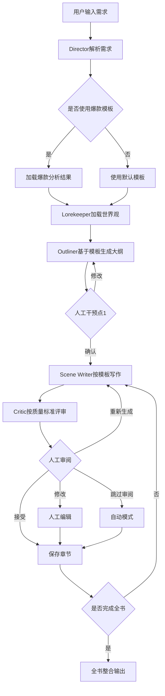
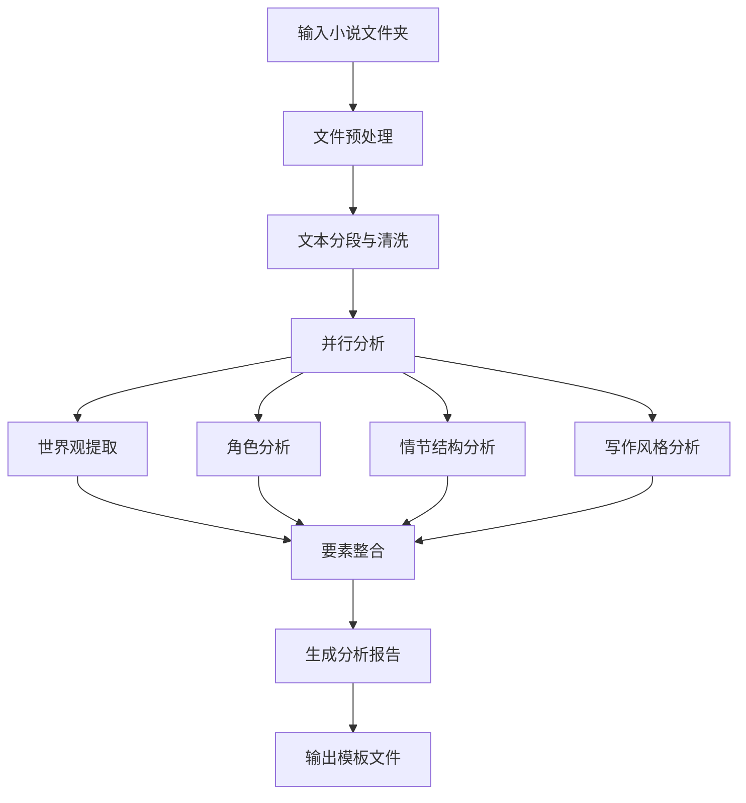

# AI小说生成系统开发方案

## 1. 项目概述

基于LangChain的多智能体网络小说自动生成系统，通过分析爆款网文特征，实现模仿创新和快速产出。

### 核心目标
- 解决LLM在长篇小说创作中的三大痛点
- 实现爆款网文分析与模仿创新
- 提供可人工干预的智能化写作流程

## 2. 痛点分析与解决方案

### 2.1 核心痛点识别

| 痛点 | 具体表现 | 影响 |
|------|----------|------|
| **有限理解推理能力** | 无法处理复杂多线程情节，逻辑漏洞频发 | 故事连贯性差，读者体验糟糕 |
| **长文本记忆缺陷** | 超过上下文窗口后遗忘前文设定 | 角色性格变化，世界观矛盾 |
| **质量控制困难** | 生成内容质量参差不齐，缺乏人工把关 | 需要大量后期修改，效率低下 |

### 2.2 解决方案架构

#### 2.2.1 分层认知架构
```
计划层 (Planning) → 转换层 (Translating) → 审阅层 (Reviewing)
    ↓                    ↓                      ↓
Director Agent      Scene Writer Agent    Critic Agent
Outliner Agent      Stylist Agent        Continuity Checker
Lorekeeper Agent    
```

#### 2.2.2 记忆管理系统（简化版）
```
长期记忆 (Chroma + JSON)
├── 世界观设定 (world_bible.json)
├── 角色档案 (characters.json)  
├── 情节大纲 (outline.json)
└── 已生成内容向量索引

短期记忆 (Python Dict)
├── 当前章节上下文
├── 待写场景列表
└── 临时约束条件
```

#### 2.2.3 人工审阅机制
```
AI生成内容 → AI自评 → 展示给用户 → 用户确认/修改 → 保存继续
```

## 3. 智能体架构设计

### 3.1 核心智能体

#### 3.1.1 Director Agent (总导演)
**职责：** 全局规划与协调控制
```python
class DirectorAgent:
    def __init__(self):
        self.planning_tools = [
            TreeOfThoughtPlanner(),
            ConflictDensityAnalyzer(),
            PacingController()
        ]
    
    def coordinate_workflow(self, user_input):
        # 解析用户需求 → 制定创作计划 → 分配任务 → 监控进度
        pass
```

**核心能力：**
- Tree-of-Thought多路径规划
- 冲突密度动态调节
- 节奏控制与张弛有度
- 人工干预点设置

#### 3.1.2 Trend Analyst Agent (爆款分析师)
**职责：** 从小说文件中提取完整的创作要素
```python
class TrendAnalystAgent:
    def __init__(self, llm):
        self.llm = llm
        self.preprocessor = NovelPreprocessor()
        self.analyzer = NovelAnalyzer(llm)
        self.template_generator = TemplateGenerator()
    
    def analyze_novel(self, novel_folder_path):
        """完整的小说分析流程"""
        # 1. 加载和预处理
        full_text, chapters = self.preprocessor.load_novel_files(novel_folder_path)
        text_segments = self.preprocessor.clean_and_segment(full_text)
        
        # 2. 并行提取核心要素
        analysis_results = {
            'world_setting': self.analyzer.extract_world_setting(text_segments),
            'characters': self.analyzer.extract_characters(text_segments),
            'plot_structure': self.analyzer.extract_plot_structure(chapters),
            'writing_style': self.analyzer.extract_writing_style(text_segments)
        }
        
        # 3. 生成创作模板
        template = self.template_generator.generate_creation_template(analysis_results)
        
        return analysis_results, template
```

**输出要素：**
- **世界观设定：** 时代背景、地理环境、规则体系
- **主要角色：** 角色档案、性格特征、关系网络
- **情节结构：** 故事框架、冲突设计、节奏控制
- **写作风格：** 语言特点、叙事技巧、描写风格

#### 3.1.3 Lorekeeper Agent (世界观管理员)
**职责：** 基于爆款模板维护世界观一致性
```python
class LorekeeperAgent:
    def __init__(self):
        self.world_bible = {}
        self.character_registry = {}
        self.template_loaded = False
    
    def load_world_bible(self, world_template):
        """加载从爆款分析得到的世界观模板"""
        self.world_bible = {
            'basic_setting': world_template['basic_setting'],
            'power_system': world_template['power_system'],
            'locations': world_template['locations'],
            'social_rules': world_template['social_rules'],
            'special_items': world_template['special_items']
        }
        self.template_loaded = True
    
    def get_world_context(self, scene_type):
        """根据场景类型提供相关世界观信息"""
        if not self.template_loaded:
            return "默认现代都市设定"
        
        context = f"""
        世界设定：{self.world_bible['basic_setting']}
        力量体系：{self.world_bible['power_system']}
        相关地点：{self.world_bible['locations']}
        社会规则：{self.world_bible['social_rules']}
        """
        return context
    
    def check_consistency(self, new_content):
        """检查新内容与世界观的一致性"""
        if not self.template_loaded:
            return True
        
        # 简单的关键词检查
        inconsistencies = []
        for rule in self.world_bible['basic_rules']:
            if self.violates_rule(new_content, rule):
                inconsistencies.append(f"违反规则：{rule}")
        
        return len(inconsistencies) == 0, inconsistencies
```

#### 3.1.4 Outliner Agent (大纲师)
**职责：** 基于爆款框架生成故事大纲
```python
class OutlinerAgent:
    def __init__(self, llm):
        self.llm = llm
        self.plot_framework = None
        
    def load_plot_framework(self, framework_template):
        """加载从爆款分析得到的情节框架"""
        self.plot_framework = framework_template
    
    def generate_story_outline(self, user_theme, target_length):
        """基于模板生成具体故事大纲"""
        if not self.plot_framework:
            return self.generate_default_outline(user_theme, target_length)
        
        outline_prompt = f"""
        基于以下爆款小说的情节框架，为新主题创作故事大纲：
        
        参考框架：
        - 故事结构：{self.plot_framework['story_structure']}
        - 冲突进展：{self.plot_framework['conflict_progression']}
        - 关键情节点：{self.plot_framework['key_plot_points']}
        - 节奏指导：{self.plot_framework['pacing_guide']}
        
        新故事要求：
        - 主题：{user_theme}
        - 目标长度：{target_length}字
        
        请生成详细的章节大纲，保持原框架的精彩结构，但内容要完全原创。
        
        输出格式：
        第X章：[章节标题]
        - 主要事件：
        - 冲突点：
        - 情感节拍：
        - 字数预估：
        """
        
        outline = self.llm.invoke(outline_prompt)
        return self.parse_outline(outline)
    
    def parse_outline(self, outline_text):
        """解析大纲文本为结构化数据"""
        # 解析章节信息
        chapters = []
        current_chapter = None
        
        for line in outline_text.split('\n'):
            if line.startswith('第') and '章：' in line:
                if current_chapter:
                    chapters.append(current_chapter)
                current_chapter = {
                    'title': line.split('：')[1],
                    'events': [],
                    'conflicts': [],
                    'emotional_beats': '',
                    'word_count': 0
                }
            elif current_chapter and line.strip():
                if '主要事件：' in line:
                    current_chapter['events'] = line.split('：')[1].split('、')
                elif '冲突点：' in line:
                    current_chapter['conflicts'] = line.split('：')[1].split('、')
                elif '情感节拍：' in line:
                    current_chapter['emotional_beats'] = line.split('：')[1]
                elif '字数预估：' in line:
                    current_chapter['word_count'] = int(line.split('：')[1].replace('字', ''))
        
        if current_chapter:
            chapters.append(current_chapter)
        
        return {'chapters': chapters, 'total_chapters': len(chapters)}
```

#### 3.1.5 Scene Writer Agent (场景作家)
**职责：** 具体内容生成
```python
class SceneWriterAgent:
    def write_scene(self, scene_brief, context):
        # 检索相关记忆 → 生成初稿 → 风格调节 → 原创性检查
        draft = self.generate_draft(scene_brief, context)
        styled_content = self.apply_style_constraints(draft)
        return self.ensure_originality(styled_content)
```

#### 3.1.6 Critic Agent (评审员)
**职责：** 内容质量评估与展示
```python
class CriticAgent:
    def evaluate_and_present(self, content):
        # AI自评内容质量
        evaluation = {
            'readability': self.assess_readability(content),
            'plot_consistency': self.check_plot_logic(content),
            'character_voice': self.check_character_consistency(content),
            'suggestions': self.generate_suggestions(content)
        }
        
        # 格式化展示给用户
        return self.format_for_human_review(content, evaluation)
```

### 3.2 智能体协作机制

#### 3.2.1 通信协议
```python
class AgentMessage:
    def __init__(self, sender, receiver, message_type, content, priority):
        self.sender = sender
        self.receiver = receiver
        self.type = message_type  # REQUEST, RESPONSE, NOTIFICATION, INTERRUPT
        self.content = content
        self.priority = priority  # HIGH, MEDIUM, LOW
        self.timestamp = datetime.now()
```

#### 3.2.2 协作模式
- **流水线模式：** Director → Outliner → Scene Writer → Critic
- **并行协作：** Scene Writer + Stylist 同时工作
- **反馈循环：** Critic → Scene Writer 迭代优化
- **紧急中断：** Continuity Checker 发现严重问题时中断流程

## 4. 工作流程设计

### 4.1 主工作流程



#### 4.1.1 模板加载机制
```python
class WorkflowController:
    def __init__(self):
        self.template_loaded = False
        self.current_template = None
    
    def load_bestseller_template(self, template_path):
        """加载爆款分析生成的模板"""
        template_files = {
            'world_bible': f"{template_path}/world_bible.json",
            'plot_framework': f"{template_path}/plot_framework.json", 
            'writing_guide': f"{template_path}/writing_guide.json",
            'character_templates': f"{template_path}/character_templates.json",
            'quality_criteria': f"{template_path}/quality_criteria.json"
        }
        
        self.current_template = {}
        for key, file_path in template_files.items():
            with open(file_path, 'r', encoding='utf-8') as f:
                self.current_template[key] = json.load(f)
        
        self.template_loaded = True
        return self.current_template
    
    def initialize_agents_with_template(self):
        """用模板初始化各个智能体"""
        if not self.template_loaded:
            raise Exception("模板未加载")
        
        # 初始化Lorekeeper的世界观
        self.lorekeeper.load_world_bible(self.current_template['world_bible'])
        
        # 初始化Outliner的情节框架
        self.outliner.load_plot_framework(self.current_template['plot_framework'])
        
        # 初始化Scene Writer的写作指导
        self.scene_writer.load_writing_guide(self.current_template['writing_guide'])
        
        # 初始化角色模板
        self.character_manager.load_templates(self.current_template['character_templates'])
        
        # 初始化Critic的质量标准
        self.critic.load_quality_criteria(self.current_template['quality_criteria'])
```

### 4.2 爆款分析工作流



#### 4.2.1 详细分析流程

**第一阶段：文件预处理**
```python
class NovelPreprocessor:
    def __init__(self, novel_folder_path):
        self.folder_path = novel_folder_path
        self.chapters = []
    
    def load_novel_files(self):
        """加载小说文件夹中的所有txt文件"""
        txt_files = []
        for file in os.listdir(self.folder_path):
            if file.endswith('.txt'):
                txt_files.append(file)
        
        # 按文件名排序（假设按章节顺序命名）
        txt_files.sort()
        
        full_text = ""
        for file in txt_files:
            with open(os.path.join(self.folder_path, file), 'r', encoding='utf-8') as f:
                content = f.read()
                full_text += content + "\n\n"
                self.chapters.append({
                    'filename': file,
                    'content': content,
                    'word_count': len(content)
                })
        
        return full_text, self.chapters
    
    def clean_and_segment(self, text):
        """文本清洗和智能分段"""
        # 去除多余空行、特殊字符
        cleaned = re.sub(r'\n{3,}', '\n\n', text)
        cleaned = re.sub(r'[^\u4e00-\u9fa5\u0030-\u0039\u0041-\u005a\u0061-\u007a\s，。！？；：""''（）【】《》\n]', '', cleaned)
        
        # 按段落分割
        paragraphs = [p.strip() for p in cleaned.split('\n\n') if p.strip()]
        
        return paragraphs
```

**第二阶段：核心要素提取**
```python
class NovelAnalyzer:
    def __init__(self, llm):
        self.llm = llm
        self.analysis_results = {}
    
    def extract_world_setting(self, text_segments):
        """提取世界观设定"""
        world_prompt = """
        分析以下小说内容，提取完整的世界观设定：
        
        请按以下格式输出：
        ## 世界观设定
        ### 时代背景
        - 时间设定：
        - 社会制度：
        - 科技水平：
        
        ### 地理环境  
        - 主要场景：
        - 地理特征：
        - 重要地点：
        
        ### 规则体系
        - 力量体系：（如修仙等级、魔法系统等）
        - 社会规则：
        - 特殊设定：
        
        小说内容：
        {text}
        """
        
        # 分批处理长文本
        world_elements = []
        for i in range(0, len(text_segments), 10):  # 每次处理10段
            batch = '\n'.join(text_segments[i:i+10])
            response = self.llm.invoke(world_prompt.format(text=batch))
            world_elements.append(response)
        
        # 整合所有世界观信息
        integration_prompt = f"""
        将以下多个世界观分析结果整合成统一完整的世界观设定：
        
        {chr(10).join(world_elements)}
        
        请输出最终统一的世界观设定。
        """
        
        final_world = self.llm.invoke(integration_prompt)
        return final_world
    
    def extract_characters(self, text_segments):
        """提取主要角色信息"""
        character_prompt = """
        分析小说内容，识别并分析主要角色：
        
        请按以下格式输出每个角色：
        ## 角色：[姓名]
        - 身份地位：
        - 性格特征：
        - 能力特长：
        - 重要关系：
        - 角色弧光：（成长变化）
        - 经典台词：
        
        小说内容：
        {text}
        """
        
        characters = []
        for i in range(0, len(text_segments), 15):
            batch = '\n'.join(text_segments[i:i+15])
            response = self.llm.invoke(character_prompt.format(text=batch))
            characters.append(response)
        
        # 角色信息去重整合
        merge_prompt = f"""
        将以下角色分析结果合并，去除重复角色，完善角色信息：
        
        {chr(10).join(characters)}
        
        输出最终的主要角色列表（按重要性排序）。
        """
        
        final_characters = self.llm.invoke(merge_prompt)
        return final_characters
    
    def extract_plot_structure(self, chapters):
        """提取情节结构"""
        plot_prompt = """
        分析小说的情节结构，提取关键情节点：
        
        请按以下格式输出：
        ## 情节结构分析
        ### 开端
        - 起始情境：
        - 主要矛盾：
        - 钩子事件：
        
        ### 发展
        - 主线发展：
        - 支线情节：
        - 冲突升级：
        
        ### 高潮
        - 关键转折：
        - 最大冲突：
        - 情感顶点：
        
        ### 结局
        - 矛盾解决：
        - 角色归宿：
        - 主题升华：
        
        ### 节奏特点
        - 情节节奏：
        - 冲突密度：
        - 高潮分布：
        
        章节内容：
        {chapters_summary}
        """
        
        # 生成章节摘要
        chapters_summary = ""
        for i, chapter in enumerate(chapters[:20]):  # 分析前20章
            summary_prompt = f"用3-5句话概括以下章节的主要内容：\n{chapter['content'][:1000]}"
            summary = self.llm.invoke(summary_prompt)
            chapters_summary += f"第{i+1}章：{summary}\n"
        
        plot_analysis = self.llm.invoke(plot_prompt.format(chapters_summary=chapters_summary))
        return plot_analysis
    
    def extract_writing_style(self, text_segments):
        """提取写作风格特征"""
        style_prompt = """
        分析小说的写作风格特征：
        
        请按以下维度分析：
        ## 写作风格分析
        ### 语言特点
        - 词汇风格：（古典/现代/网络用语等）
        - 句式特点：（长短句比例、复句使用等）
        - 修辞手法：（比喻、拟人、排比等）
        
        ### 叙事特点
        - 叙事视角：（第一人称/第三人称/全知视角）
        - 时间结构：（顺叙/倒叙/插叙）
        - 节奏控制：（快节奏/慢节奏/张弛有度）
        
        ### 对话风格
        - 对话比例：（对话与叙述的比例）
        - 语言个性化：（角色语言区分度）
        - 对话功能：（推进情节/刻画性格/营造氛围）
        
        ### 描写特色
        - 环境描写：（详略程度、描写重点）
        - 人物描写：（外貌/心理/动作描写特点）
        - 场面描写：（战斗/日常/情感场面特色）
        
        文本样本：
        {text}
        """
        
        # 随机采样分析
        import random
        sample_segments = random.sample(text_segments, min(20, len(text_segments)))
        sample_text = '\n'.join(sample_segments)
        
        style_analysis = self.llm.invoke(style_prompt.format(text=sample_text))
        return style_analysis
```

**第三阶段：标准化输出生成**
```python
class TemplateGenerator:
    def __init__(self, analysis_results):
        self.analysis = analysis_results
    
    def generate_standard_output(self):
        """生成主工作流程可直接使用的标准化输出"""
        return {
            # 1. 世界观设定 - 直接供Lorekeeper使用
            "world_bible": {
                "basic_setting": self.extract_world_basics(),
                "power_system": self.extract_power_rules(),
                "locations": self.extract_key_locations(),
                "social_rules": self.extract_social_structure(),
                "special_items": self.extract_special_elements()
            },
            
            # 2. 角色模板 - 直接供Character创建使用
            "character_templates": {
                "protagonist": self.extract_protagonist_template(),
                "antagonist": self.extract_antagonist_template(), 
                "supporting_cast": self.extract_support_templates(),
                "character_relationships": self.extract_relationship_patterns()
            },
            
            # 3. 情节框架 - 直接供Outliner使用
            "plot_framework": {
                "story_structure": self.extract_act_structure(),
                "conflict_progression": self.extract_conflict_escalation(),
                "key_plot_points": self.extract_turning_points(),
                "pacing_guide": self.extract_rhythm_patterns(),
                "chapter_templates": self.extract_chapter_patterns()
            },
            
            # 4. 写作指导 - 直接供Scene Writer使用
            "writing_guide": {
                "narrative_voice": self.extract_narrative_style(),
                "dialogue_style": self.extract_dialogue_patterns(),
                "description_templates": self.extract_description_styles(),
                "scene_transition": self.extract_transition_methods(),
                "emotional_beats": self.extract_emotional_patterns()
            },
            
            # 5. 质量标准 - 直接供Critic使用
            "quality_criteria": {
                "style_consistency": self.extract_style_rules(),
                "character_voice_guide": self.extract_voice_consistency(),
                "plot_logic_rules": self.extract_logic_patterns(),
                "pacing_standards": self.extract_pacing_standards()
            }
        }
    
    def extract_world_basics(self):
        """提取基础世界观设定"""
        world_data = self.analysis['world_setting']
        
        # 使用LLM提取结构化数据
        extraction_prompt = f"""
        从以下世界观分析中提取结构化的基础设定信息：
        
        {world_data}
        
        请按以下JSON格式输出：
        {{
            "time_period": "具体时代背景",
            "world_type": "现代都市/古代仙侠/未来科幻等",
            "core_concept": "核心世界观概念",
            "basic_rules": ["基本规则1", "基本规则2", "..."]
        }}
        """
        
        result = self.llm.invoke(extraction_prompt)
        return json.loads(result)
    
    def extract_protagonist_template(self):
        """提取主角模板"""
        character_data = self.analysis['characters']
        
        extraction_prompt = f"""
        从角色分析中提取主角的模板信息：
        
        {character_data}
        
        请按以下JSON格式输出主角模板：
        {{
            "archetype": "主角原型类型",
            "initial_state": {{
                "background": "出身背景",
                "personality_traits": ["性格特征列表"],
                "abilities": ["初始能力"],
                "goals": ["主要目标"],
                "flaws": ["性格缺陷"]
            }},
            "growth_arc": {{
                "key_transformations": ["关键转变点"],
                "power_progression": ["实力成长路径"],
                "personality_development": ["性格发展轨迹"]
            }},
            "relationship_patterns": {{
                "romance": "感情线模式",
                "friendship": "友情线模式", 
                "rivalry": "对抗关系模式"
            }}
        }}
        """
        
        result = self.llm.invoke(extraction_prompt)
        return json.loads(result)
    
    def extract_act_structure(self):
        """提取故事结构模板"""
        plot_data = self.analysis['plot_structure']
        
        extraction_prompt = f"""
        从情节分析中提取标准的故事结构模板：
        
        {plot_data}
        
        请按以下JSON格式输出：
        {{
            "three_act_structure": {{
                "act1": {{
                    "percentage": "占全文比例",
                    "key_elements": ["关键要素"],
                    "major_events": ["主要事件类型"],
                    "ending_hook": "第一幕结尾钩子模式"
                }},
                "act2": {{
                    "percentage": "占全文比例", 
                    "midpoint": "中点转折模式",
                    "conflict_escalation": ["冲突升级模式"],
                    "subplots": ["支线情节类型"]
                }},
                "act3": {{
                    "percentage": "占全文比例",
                    "climax_pattern": "高潮模式",
                    "resolution_style": "结局风格"
                }}
            }}
        }}
        """
        
        result = self.llm.invoke(extraction_prompt)
        return json.loads(result)
    
    def save_for_main_workflow(self, output_dir):
        """保存供主工作流程使用的文件"""
        standard_output = self.generate_standard_output()
        
        # 分别保存各个组件需要的文件
        os.makedirs(output_dir, exist_ok=True)
        
        # Lorekeeper使用的世界观文件
        with open(f"{output_dir}/world_bible.json", 'w', encoding='utf-8') as f:
            json.dump(standard_output['world_bible'], f, ensure_ascii=False, indent=2)
        
        # Outliner使用的情节框架
        with open(f"{output_dir}/plot_framework.json", 'w', encoding='utf-8') as f:
            json.dump(standard_output['plot_framework'], f, ensure_ascii=False, indent=2)
        
        # Scene Writer使用的写作指导
        with open(f"{output_dir}/writing_guide.json", 'w', encoding='utf-8') as f:
            json.dump(standard_output['writing_guide'], f, ensure_ascii=False, indent=2)
        
        # Character创建使用的角色模板
        with open(f"{output_dir}/character_templates.json", 'w', encoding='utf-8') as f:
            json.dump(standard_output['character_templates'], f, ensure_ascii=False, indent=2)
        
        # Critic使用的质量标准
        with open(f"{output_dir}/quality_criteria.json", 'w', encoding='utf-8') as f:
            json.dump(standard_output['quality_criteria'], f, ensure_ascii=False, indent=2)
        
        return standard_output
```

### 4.3 人工干预机制

#### 4.3.1 干预触发条件
- **主动干预点：** 大纲确认、章节审核、风格调整
- **被动干预点：** 质量评分低于阈值、一致性检查失败、原创性不足

#### 4.3.2 人工审阅接口设计
```python
class HumanReviewInterface:
    def __init__(self):
        self.review_enabled = True  # 可配置开关
    
    def present_for_review(self, content, ai_evaluation):
        """展示AI生成的内容和评估给用户"""
        print("="*50)
        print("📝 AI生成内容:")
        print(content)
        print("\n🤖 AI自评:")
        for key, value in ai_evaluation.items():
            print(f"  {key}: {value}")
        
        if not self.review_enabled:
            return "auto_accept"
            
        print("\n请选择操作:")
        print("1. 接受并继续")
        print("2. 修改后保存") 
        print("3. 重新生成")
        print("4. 跳过人工审阅模式")
        
        choice = input("请输入选择 (1-4): ")
        return self.handle_user_choice(choice, content)
    
    def handle_user_choice(self, choice, content):
        if choice == "1":
            return "accept"
        elif choice == "2":
            modified = input("请输入修改后的内容:\n")
            return {"action": "modify", "content": modified}
        elif choice == "3":
            return "regenerate"
        elif choice == "4":
            self.review_enabled = False
            return "auto_accept"
        else:
            return "accept"  # 默认接受
```

## 5. 技术实现要点

### 5.1 核心技术栈（简化本地版）
- **框架：** LangChain 1.0
- **LLM：** OpenAI API (GPT-4) 或 本地Ollama
- **向量存储：** Chroma (轻量级本地向量数据库)
- **数据存储：** SQLite + JSON文件
- **配置：** YAML配置文件
- **依赖管理：** Poetry/pip

### 5.2 关键算法（简化实现）

#### 5.2.1 内容检索与上下文管理
```python
import chromadb

class ContentRetriever:
    def __init__(self):
        self.chroma_client = chromadb.Client()
        self.collection = self.chroma_client.create_collection("novel_memory")
    
    def retrieve_relevant_context(self, current_scene, n_results=3):
        """检索相关的历史内容作为上下文"""
        results = self.collection.query(
            query_texts=[current_scene], 
            n_results=n_results
        )
        return results['documents'][0] if results['documents'] else []
    
    def store_content(self, content, metadata):
        """存储新生成的内容"""
        self.collection.add(
            documents=[content],
            metadatas=[metadata],
            ids=[f"content_{len(self.collection.get()['ids'])}"]
        )
```

#### 5.2.2 轻量级记忆管理
```python
import json
import os

class SimpleMemoryManager:
    def __init__(self, data_dir="./novel_data"):
        self.data_dir = data_dir
        self.working_memory = {}
        os.makedirs(data_dir, exist_ok=True)
    
    def save_to_file(self, filename, data):
        with open(f"{self.data_dir}/{filename}", 'w', encoding='utf-8') as f:
            json.dump(data, f, ensure_ascii=False, indent=2)
    
    def load_from_file(self, filename):
        try:
            with open(f"{self.data_dir}/{filename}", 'r', encoding='utf-8') as f:
                return json.load(f)
        except FileNotFoundError:
            return {}
```

### 5.3 人工审阅流程

#### 5.3.1 审阅展示格式
```python
class ReviewPresenter:
    def format_content_for_review(self, content, ai_eval):
        """格式化内容供人工审阅"""
        review_text = f"""
{'='*60}
📖 生成内容 (第{ai_eval.get('chapter', 'X')}章):
{'-'*60}
{content}
{'-'*60}

🤖 AI自评报告:
• 可读性: {ai_eval.get('readability', 'N/A')}
• 情节连贯性: {ai_eval.get('plot_consistency', 'N/A')} 
• 角色一致性: {ai_eval.get('character_voice', 'N/A')}
• 改进建议: {ai_eval.get('suggestions', '无')}

{'='*60}
        """
        return review_text
```

#### 5.3.2 配置化审阅模式
```yaml
# config.yaml
review_settings:
  enabled: true              # 是否启用人工审阅
  auto_accept_threshold: 8.0 # AI自评分超过此值自动通过
  review_points:             # 审阅触发点
    - "chapter_complete"     # 章节完成时
    - "character_dialogue"   # 重要对话时
    - "plot_turning_point"   # 情节转折时
```

## 6. 项目实施计划

### 6.1 开发阶段

#### Phase 1: 基础框架 (1-2周)
- [ ] LangChain 1.0 基础环境搭建
- [ ] 核心Agent类设计 (Director, Writer, Critic)
- [ ] 简单的顺序工作流实现
- [ ] JSON文件数据存储

#### Phase 2: 记忆与生成 (1-2周)  
- [ ] Chroma向量数据库集成
- [ ] 简单的记忆检索机制
- [ ] Scene Writer内容生成
- [ ] 基础一致性检查

#### Phase 3: 爆款分析功能 (2-3周)
- [ ] 文本特征提取工具
- [ ] 简单的模板匹配算法
- [ ] 爆款数据预处理工具
- [ ] 模板应用与变换机制

#### Phase 4: 用户交互与优化 (1-2周)
- [ ] 命令行交互界面
- [ ] 人工干预确认点
- [ ] 配置文件管理
- [ ] 基础测试与调优

### 6.2 测试验证

#### 6.2 简单验证
- 基础工作流程测试
- 人工审阅界面测试
- 数据存储读取测试
- 小规模内容生成验证

## 7. 风险评估与应对

### 7.1 技术风险（简化版）
| 风险 | 影响 | 应对策略 |
|------|------|----------|
| OpenAI API费用 | 成本过高 | 集成本地Ollama模型 |
| 内存占用过大 | 本地PC性能不足 | 分段处理，及时清理 |
| 文件存储管理 | 数据混乱 | 规范化文件命名和目录结构 |

### 7.2 使用风险
| 风险 | 影响 | 应对策略 |
|------|------|----------|
| 生成内容质量不稳定 | 需要大量人工修改 | 完善AI评估机制 |
| 人工审阅效率低 | 整体生成速度慢 | 提供可选的自动模式 |
| 用户操作复杂 | 使用门槛高 | 简化交互界面 |

## 8. 后续扩展方向

### 8.1 后续扩展（保持简单）
- Web界面替代命令行
- 更多本地LLM模型支持
- 导出多种格式 (PDF、EPUB)
- 简单的数据统计和可视化

### 8.2 项目文件结构
```
ai_novel/
├── agents/              # 智能体模块
│   ├── director.py
│   ├── trend_analyst.py # 爆款分析师
│   ├── writer.py
│   └── critic.py
├── analyzers/           # 分析工具模块
│   ├── preprocessor.py  # 文件预处理
│   ├── novel_analyzer.py # 内容分析
│   └── template_generator.py # 模板生成
├── tools/               # 工具模块  
│   ├── memory.py
│   └── content_retriever.py
├── data/                # 数据存储
│   ├── input_novels/    # 待分析的爆款小说
│   ├── analysis_reports/ # 分析报告
│   ├── templates/       # 提取的创作模板
│   ├── generated_novels/ # 生成的小说
│   └── config.yaml      # 配置文件
├── main.py              # 主程序入口
├── analyze_novel.py     # 爆款分析入口
└── requirements.txt     # 依赖列表
```

### 8.3 使用示例

#### 8.3.1 分析爆款小说
```bash
# 分析单本小说（文件夹包含多个txt章节）
python analyze_novel.py --input ./data/input_novels/斗破苍穹/ --output ./data/templates/斗破苍穹_template/

# 输出文件（直接供主工作流使用）：
# - world_bible.json        # Lorekeeper使用的世界观
# - plot_framework.json     # Outliner使用的情节框架  
# - writing_guide.json      # Scene Writer使用的写作指导
# - character_templates.json # 角色创建模板
# - quality_criteria.json   # Critic使用的质量标准
```

#### 8.3.2 基于模板创作新小说
```bash
# 使用爆款模板创作新小说
python main.py --template ./data/templates/斗破苍穹_template/ --theme "现代都市修仙" --length 100000

# 工作流程：
# 1. 自动加载模板到各个Agent
# 2. 基于斗破的框架生成现代都市修仙大纲
# 3. 按斗破的写作风格进行内容生成
# 4. 用斗破的质量标准进行评审
# 5. 关键节点人工审阅确认
```

#### 8.3.3 完整使用流程示例
```python
# 1. 先分析爆款
analyzer = TrendAnalystAgent(llm)
analysis_result, template = analyzer.analyze_novel("./data/input_novels/斗破苍穹/")

# 2. 保存为标准模板
template_generator = TemplateGenerator(analysis_result)
template_generator.save_for_main_workflow("./data/templates/斗破苍穹_template/")

# 3. 主工作流使用模板
workflow = WorkflowController()
workflow.load_bestseller_template("./data/templates/斗破苍穹_template/")
workflow.initialize_agents_with_template()

# 4. 开始创作
novel = workflow.create_novel(theme="现代都市修仙", length=100000)
```

---

**注：** 本方案重点关注核心工作流程和智能体设计，前后端界面开发将在后续阶段根据实际需求进行设计实现。