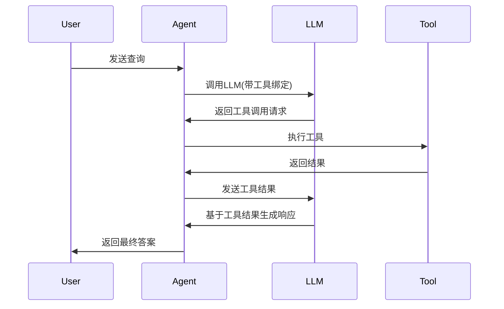

# Novel Generator - AI小说生成系统

基于多智能体协作的AI小说生成系统。

## 🏗️ 架构

```
novel_generator/
├── agents/              # 智能体模块
│   ├── base_agent.py              # 基础智能体
│   ├── base_agent_with_tools.py   # 支持工具调用的智能体 ⭐NEW
│   ├── director_agent.py          # 导演智能体
│   ├── outliner_agent.py          # 大纲智能体
│   ├── scene_writer_agent.py      # 场景写作智能体
│   ├── critic_agent.py            # 评论智能体
│   └── research_agent.py          # 研究智能体 ⭐NEW
├── tools/               # 工具模块 ⭐NEW
│   └── tool_manager.py            # 工具管理器
├── workflows/           # 工作流
│   └── simple_workflow.py         # 简单工作流
└── README.md
```

## 🚀 快速开始

### 1. 基础端到端Demo

```bash
# 运行基础小说生成流程
python demo_e2e.py
```

### 2. Function Call 工具Demo ⭐NEW

```bash
# 运行工具调用演示
python demo_tools.py
```

## 🤖 智能体类型

### BaseAgent
所有智能体的基类,提供基础的LLM调用能力。

### BaseAgentWithTools ⭐NEW
支持 Function Calling 的增强版智能体基类。

**特性:**
- 自动绑定工具到LLM
- 处理工具调用流程
- 支持多轮对话
- 完善的错误处理
- 工具调用日志

### ResearchAgent ⭐NEW
研究型智能体,能够读取和分析本地文件。

**能力:**
- 📖 读取本地文件
- 🔍 搜索文件内容
- 📁 列出目录结构
- ✍️ 写入文件
- 📊 分析数据并生成洞察

**应用场景:**
```python
from novel_generator.agents import ResearchAgent

agent = ResearchAgent()

# 场景1: 分析小说数据
result = agent.analyze_novel_data(
    novel_name="仙侠小说",
    data_dir="demo_output"
)

# 场景2: 从代码中学习
result = agent.learn_from_code(
    code_dir="tools/implementations",
    topic="文件系统工具实现"
)

# 场景3: 自定义研究任务
result = agent.run({
    'query': '请读取demo_output目录下的文件,总结主要特点'
})
```

### DirectorAgent
导演智能体,负责整体创作方向规划。

### OutlinerAgent
大纲智能体,生成章节大纲。

### SceneWriterAgent
场景写作智能体,创作具体场景内容。

### CriticAgent
评论智能体,评估和改进内容质量。

## 🛠️ 工具系统 ⭐NEW

### ToolManager
集中管理所有可用工具。

**可用工具:**
- `read_file` - 读取本地文件
- `write_file` - 写入文件
- `list_directory` - 列出目录
- `search_file_content` - 搜索文件内容
- `get_current_time` - 获取当前时间

### 使用示例

```python
from novel_generator.tools import ToolManager

# 创建工具管理器
tm = ToolManager()

# 获取所有工具
all_tools = tm.get_all_tools()

# 获取文件系统工具
fs_tools = tm.get_file_system_tools()

# 列出可用工具
tools_info = tm.list_available_tools()
```

## 🔧 自定义智能体

### 创建基础智能体

```python
from novel_generator.agents import BaseAgent

class MyAgent(BaseAgent):
    def run(self, input_data):
        prompt = f"请处理: {input_data['task']}"
        result = self.invoke_llm(prompt)
        return {'result': result}
```

### 创建带工具的智能体

```python
from novel_generator.agents import BaseAgentWithTools

class MyToolAgent(BaseAgentWithTools):
    def __init__(self):
        # 可以选择特定工具
        super().__init__(
            agent_name="MyToolAgent",
            tools=None,  # None = 使用所有文件系统工具
            max_iterations=10
        )
    
    def run(self, input_data):
        result = self.invoke_with_tools(
            prompt=input_data['query'],
            verbose=True
        )
        return {'result': result}
```

## 📊 工作流

### SimpleWorkflow
简单的线性工作流: Director → Outliner → SceneWriter

```python
from novel_generator.workflows import SimpleWorkflow

workflow = SimpleWorkflow()
result = workflow.run({
    'theme': '仙侠',
    'style': '热血',
    'target_length': '短篇'
})
```

## 🔍 Function Call 工作原理



## 📝 示例输出

运行 `demo_tools.py` 会展示:

1. ✅ 基础文件读取
2. ✅ 目录探索
3. ✅ 分析小说数据
4. ✅ 搜索文件内容
5. ✅ 从代码中学习
6. ✅ 多文件综合分析
7. ✅ 错误处理
8. ✅ 创意任务

## 🎯 下一步开发

- [ ] 添加更多专业工具(数据分析、图表生成等)
- [ ] 实现智能体间的协作机制
- [ ] 添加记忆系统
- [ ] 集成向量数据库进行语义搜索
- [ ] 添加更多工作流模式

## 📚 依赖

```bash
langchain
langchain-openai
langchain-ollama
python-dotenv
```

## 🔐 环境配置

创建 `.env` 文件:
```bash
OPENAI_API_KEY=your_key_here
# 或使用本地 Ollama
# 系统会自动降级到 Ollama
```

---

⭐ **新功能亮点**: Function Call 工具系统让智能体能够自主读取和分析本地文件,大大增强了智能体的实用性!
