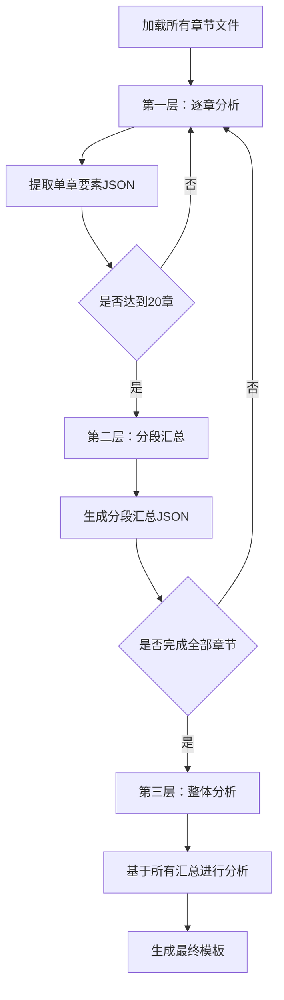

# 爆款分析工作流开发文档

## 1. 项目概述

### 1.1 目标
开发一个独立的爆款小说分析系统，采用分层概括的方式处理长篇小说，从多个txt文件中提取核心要素，生成标准化的创作模板。

### 1.2 核心功能
- 批量加载并预处理txt小说文件
- **分层概括：** 逐章提取 → 分段汇总 → 整体分析
- 提取世界观、角色、情节、风格四大要素
- 生成标准化JSON格式的模板文件
- 输出人类可读的分析报告

### 1.3 分层处理策略

**三层处理架构：**
```
第一层：单章分析（逐章提取要素）
  ↓
第二层：分段汇总（每20章总结一次）
  ↓  
第三层：整体分析（基于汇总结果分析全文）
```

### 1.4 输入输出

**输入：**
```
input_novels/
└── 斗破苍穹/
    ├── 第001章.txt
    ├── 第002章.txt
    ├── 第003章.txt
    └── ...（共300章）
```

**中间产物：**
```
斗破苍穹_intermediate/
├── chapter_summaries/
│   ├── chapter_001.json    # 第1章提取结果
│   ├── chapter_002.json
│   └── ...
├── segment_summaries/
│   ├── segment_001-020.json  # 第1-20章汇总
│   ├── segment_021-040.json  # 第21-40章汇总
│   └── ...
└── extraction_log.json     # 处理日志
```

**最终输出：**
```
templates/斗破苍穹_template/
├── world_bible.json          # 世界观设定
├── plot_framework.json       # 情节框架
├── writing_guide.json        # 写作指导
├── character_templates.json  # 角色模板
├── quality_criteria.json     # 质量标准
└── analysis_report.md        # 人类可读的分析报告
```

## 2. 技术架构

### 2.1 技术栈
- **Python 3.10+**
- **LangChain 1.0** - LLM调用框架
- **OpenAI API** (GPT-4) 或 **Ollama** (本地模型)
- **标准库：** os, json, re, pathlib

### 2.2 项目结构
```
novel_analyzer/
├── analyzers/
│   ├── __init__.py
│   ├── preprocessor.py          # 文件预处理模块
│   ├── chapter_analyzer.py      # 单章分析器
│   ├── segment_summarizer.py    # 分段汇总器
│   ├── overall_analyzer.py      # 整体分析器
│   └── extractors/
│       ├── world_extractor.py
│       ├── character_extractor.py
│       ├── plot_extractor.py
│       └── style_extractor.py
├── generators/
│   ├── __init__.py
│   └── template_generator.py    # 模板生成器
├── utils/
│   ├── __init__.py
│   ├── file_utils.py            # 文件操作工具
│   ├── json_parser.py           # JSON解析工具
│   └── prompt_templates.py      # Prompt模板库
├── config/
│   └── config.yaml              # 配置文件
├── data/
│   ├── input_novels/            # 输入小说目录
│   ├── intermediate/            # 中间结果目录
│   └── output_templates/        # 输出模板目录
├── main.py                      # 主程序入口
├── requirements.txt             # 依赖列表
└── README.md                    # 使用说明
```

## 3. 核心处理流程

### 3.1 分层处理详细流程



### 3.2 第一层：单章分析

**目标：** 从每一章中提取关键信息

**输出格式 (chapter_XXX.json)：**
```json
{
  "chapter_number": 1,
  "chapter_title": "陨落的天才",
  "word_count": 3245,
  "characters": [
    {
      "name": "萧炎",
      "role": "protagonist",
      "first_appearance": true,
      "status_changes": ["斗气等级下降"],
      "relationships": ["萧薰儿的关注"]
    }
  ],
  "locations": [
    {
      "name": "萧家",
      "type": "家族驻地",
      "first_appearance": true
    }
  ],
  "events": [
    {
      "type": "conflict",
      "description": "萧炎被家族弟子嘲笑",
      "importance": "high",
      "emotional_tone": "屈辱、不甘"
    }
  ],
  "world_elements": [
    {
      "type": "power_system",
      "element": "斗气等级",
      "details": "从天才跌落到废物"
    }
  ],
  "writing_style_notes": {
    "narrative_perspective": "第三人称",
    "key_phrases": ["三年之约"],
    "emotional_intensity": "high"
  }
}
```

### 3.3 第二层：分段汇总

**目标：** 每20章汇总一次，提炼关键信息

**输入：** 20个章节的JSON文件
**输出格式 (segment_001-020.json)：**
```json
{
  "segment_range": "001-020",
  "total_chapters": 20,
  "total_words": 65000,
  "characters_summary": {
    "main_characters": [
      {
        "name": "萧炎",
        "role": "protagonist",
        "development": "从废材到发现戒指秘密",
        "key_relationships": ["萧薰儿", "药老"],
        "power_growth": "斗之气一段 → 三段"
      }
    ],
    "new_characters": ["药老", "萧薰儿", "萧宁"],
    "character_count": 8
  },
  "locations_summary": {
    "main_locations": ["萧家", "乌坦城", "魔兽山脉"],
    "location_count": 5
  },
  "plot_summary": {
    "main_storyline": "萧炎发现戒指中的药老，开始恢复斗气",
    "key_events": [
      "发现戒指秘密",
      "遇见药老",
      "第一次炼药",
      "与萧薰儿的约定"
    ],
    "conflicts": ["家族内部矛盾", "萧炎的自我证明"],
    "emotional_arc": "屈辱 → 希望 → 决心"
  },
  "world_building": {
    "power_system_details": ["斗之气等级体系", "炼药师体系"],
    "social_structure": ["家族制度", "炼药师地位"],
    "special_items": ["纳戒", "异火"]
  },
  "style_patterns": {
    "chapter_structure": "事件-冲突-小高潮-钩子",
    "pacing": "快节奏",
    "dialogue_ratio": "中等"
  }
}
```

### 3.4 第三层：整体分析

**目标：** 基于所有分段汇总，进行全局分析

**输入：** 所有segment汇总JSON
**输出：** 最终的5个模板文件

## 4. 核心模块设计

### 4.1 文件预处理模块 (preprocessor.py)

**职责：** 加载、清洗、组织小说文本

**核心方法：**
- `load_novel_files()` - 加载所有txt文件
- `clean_text()` - 文本清洗
- `get_chapter_info()` - 获取章节基本信息
- `get_statistics()` - 统计信息

### 4.2 单章分析器 (chapter_analyzer.py)

**职责：** 分析单个章节，提取关键要素

**核心方法：**
- `analyze_chapter()` - 分析单章内容
- `extract_characters()` - 提取角色信息
- `extract_locations()` - 提取地点信息
- `extract_events()` - 提取事件信息
- `extract_world_elements()` - 提取世界观要素
- `save_chapter_result()` - 保存单章结果

**输出数据结构：**
```json
{
  "chapter_number": "整数",
  "chapter_title": "标题",
  "word_count": "字数",
  "characters": [],
  "locations": [],
  "events": [],
  "world_elements": [],
  "writing_style_notes": {}
}
```

### 4.3 分段汇总器 (segment_summarizer.py)

**职责：** 汇总N个章节的分析结果

**核心方法：**
- `summarize_segment()` - 汇总指定范围章节
- `merge_characters()` - 合并角色信息
- `merge_locations()` - 合并地点信息
- `summarize_plot()` - 总结情节发展
- `extract_patterns()` - 提取写作模式
- `save_segment_summary()` - 保存分段汇总

**输出数据结构：**
```json
{
  "segment_range": "起始-结束",
  "total_chapters": "章节数",
  "characters_summary": {},
  "locations_summary": {},
  "plot_summary": {},
  "world_building": {},
  "style_patterns": {}
}
```

### 4.4 整体分析器 (overall_analyzer.py)

**职责：** 基于所有分段汇总进行全局分析

**核心方法：**
- `analyze_all_segments()` - 分析所有分段汇总
- `extract_world_bible()` - 提取完整世界观
- `extract_character_templates()` - 提取角色模板
- `extract_plot_framework()` - 提取情节框架
- `extract_writing_guide()` - 提取写作指导
- `extract_quality_criteria()` - 提取质量标准

### 4.5 各要素提取器

#### 4.5.1 世界观提取器 (world_extractor.py)

**提取内容：**
```json
{
  "basic_setting": {
    "time_period": "时代背景",
    "world_type": "世界类型",
    "core_concept": "核心概念",
    "basic_rules": []
  },
  "power_system": {
    "system_name": "力量体系名称",
    "levels": [],
    "advancement_method": "提升方式",
    "special_abilities": []
  },
  "locations": [],
  "social_rules": {},
  "special_items": []
}
```

#### 4.5.2 角色提取器 (character_extractor.py)

**提取内容：**
```json
{
  "protagonist": {
    "name": "主角名字",
    "archetype": "角色原型",
    "initial_state": {},
    "growth_arc": {},
    "relationships": {}
  },
  "antagonist": {},
  "supporting_cast": []
}
```

#### 4.5.3 情节提取器 (plot_extractor.py)

**提取内容：**
```json
{
  "story_structure": {
    "act1": {},
    "act2": {},
    "act3": {}
  },
  "conflict_progression": {},
  "key_plot_points": [],
  "pacing_guide": {},
  "chapter_templates": {}
}
```

#### 4.5.4 风格提取器 (style_extractor.py)

**提取内容：**
```json
{
  "narrative_voice": {},
  "dialogue_style": {},
  "description_templates": {},
  "scene_transition": {},
  "emotional_beats": {},
  "language_features": {}
}
```

### 4.6 模板生成器 (template_generator.py)

**职责：** 整合所有提取结果，生成最终标准化模板

**核心方法：**
- `generate_world_bible()` - 生成世界观模板
- `generate_plot_framework()` - 生成情节框架
- `generate_writing_guide()` - 生成写作指导
- `generate_character_templates()` - 生成角色模板
- `generate_quality_criteria()` - 生成质量标准
- `save_all_templates()` - 保存所有模板
- `generate_markdown_report()` - 生成分析报告

## 5. Prompt设计模板

### 5.1 单章分析Prompt

**章节要素提取：**
```
分析以下小说章节，提取关键信息。

章节内容：
{chapter_text}

请严格按照以下JSON格式输出：
{
  "chapter_number": 章节序号,
  "characters": [
    {
      "name": "角色名",
      "role": "protagonist/antagonist/supporting",
      "first_appearance": true/false,
      "status_changes": ["变化描述"],
      "relationships": ["关系描述"]
    }
  ],
  "locations": [
    {
      "name": "地点名",
      "type": "地点类型",
      "first_appearance": true/false
    }
  ],
  "events": [
    {
      "type": "conflict/development/climax",
      "description": "事件描述",
      "importance": "high/medium/low",
      "emotional_tone": "情感基调"
    }
  ],
  "world_elements": [
    {
      "type": "power_system/social_rule/special_item",
      "element": "要素名称",
      "details": "详细信息"
    }
  ],
  "writing_style_notes": {
    "narrative_perspective": "叙事视角",
    "key_phrases": ["关键短语"],
    "emotional_intensity": "high/medium/low"
  }
}

只输出JSON，不要其他文字。
```

### 5.2 分段汇总Prompt

**分段概括：**
```
基于以下20个章节的分析结果，进行汇总概括。

章节分析数据：
{章节JSON列表}

请严格按照以下JSON格式输出：
{
  "segment_range": "起始-结束",
  "characters_summary": {
    "main_characters": [
      {
        "name": "角色名",
        "role": "角色定位",
        "development": "发展变化",
        "key_relationships": [],
        "power_growth": "实力成长"
      }
    ],
    "new_characters": [],
    "character_count": 数字
  },
  "locations_summary": {
    "main_locations": [],
    "location_count": 数字
  },
  "plot_summary": {
    "main_storyline": "主线剧情概述",
    "key_events": [],
    "conflicts": [],
    "emotional_arc": "情感曲线"
  },
  "world_building": {
    "power_system_details": [],
    "social_structure": [],
    "special_items": []
  },
  "style_patterns": {
    "chapter_structure": "章节结构模式",
    "pacing": "节奏",
    "dialogue_ratio": "对话比例"
  }
}

只输出JSON，不要其他文字。
```

### 5.3 整体分析Prompt

**世界观整合：**
```
基于以下所有分段汇总，提取完整的世界观设定。

分段汇总数据：
{所有segment JSON}

请严格按照以下JSON格式输出完整世界观：
{
  "basic_setting": {...},
  "power_system": {...},
  "locations": [...],
  "social_rules": {...},
  "special_items": [...]
}

只输出JSON，不要其他文字。
```

**角色模板整合、情节框架整合、风格指导整合等类似设计**

## 6. 开发流程

### 6.1 Phase 1: 基础框架搭建（2-3天）

**任务清单：**
- [ ] 创建项目目录结构
- [ ] 配置开发环境和依赖
- [ ] 实现文件预处理模块
- [ ] 实现文件工具和JSON解析工具
- [ ] 测试数据准备（1本小说样本，约50章）

**验收标准：**
- 能够成功加载所有章节文件
- 文本清洗正常
- 能正确识别章节顺序和统计信息

### 6.2 Phase 2: 单章分析器开发（3-4天）

**任务清单：**
- [ ] 实现ChapterAnalyzer类
- [ ] 设计单章分析Prompt
- [ ] 实现章节要素提取逻辑
- [ ] 实现JSON结果保存
- [ ] 测试单章分析功能
- [ ] 优化Prompt准确性

**验收标准：**
- 能成功分析单个章节
- 输出JSON格式正确
- 提取的信息准确完整
- 可以批量处理多章

### 6.3 Phase 3: 分段汇总器开发（2-3天）

**任务清单：**
- [ ] 实现SegmentSummarizer类
- [ ] 设计分段汇总Prompt
- [ ] 实现角色/地点/事件合并逻辑
- [ ] 实现情节概括逻辑
- [ ] 测试分段汇总功能

**验收标准：**
- 能正确汇总20章内容
- 信息去重和整合正确
- 概括准确且不遗漏关键信息

### 6.4 Phase 4: 整体分析器和提取器开发（4-5天）

**任务清单：**
- [ ] 实现OverallAnalyzer类
- [ ] 实现WorldExtractor
- [ ] 实现CharacterExtractor
- [ ] 实现PlotExtractor
- [ ] 实现StyleExtractor
- [ ] 设计整合Prompt
- [ ] 测试各提取器功能

**验收标准：**
- 能基于所有分段汇总进行分析
- 各提取器输出格式正确
- 提取的模板质量高

### 6.5 Phase 5: 模板生成器开发（2-3天）

**任务清单：**
- [ ] 实现TemplateGenerator类
- [ ] 实现5个模板生成方法
- [ ] 实现文件保存功能
- [ ] 实现markdown报告生成
- [ ] 测试完整流程

**验收标准：**
- 能生成5个标准JSON文件
- JSON格式规范且完整
- markdown报告美观易读

### 6.6 Phase 6: 主程序集成（1-2天）

**任务清单：**
- [ ] 实现main.py主流程
- [ ] 添加命令行参数
- [ ] 添加进度条显示
- [ ] 添加错误处理和重试机制
- [ ] 添加日志记录
- [ ] 编写README文档

**验收标准：**
- 完整流程运行流畅
- 进度显示清晰
- 错误处理完善
- 文档完整

### 6.7 Phase 7: 测试与优化（2-3天）

**任务清单：**
- [ ] 使用完整小说进行端到端测试
- [ ] 测试不同类型小说（仙侠、都市、科幻）
- [ ] 收集和修复bug
- [ ] 优化Prompt提高准确性
- [ ] 优化性能和内存使用
- [ ] 代码重构和清理

**验收标准：**
- 能成功分析至少2本完整小说（200+章）
- 提取的模板质量高
- 运行稳定无崩溃
- 处理速度合理

## 7. 配置文件设计

### 7.1 config.yaml
```yaml
# LLM配置
llm:
  provider: "openai"
  model: "gpt-4"
  api_key: "your-api-key-here"
  base_url: null
  temperature: 0.3
  max_tokens: 3000

# 分层处理配置
processing:
  chapter_batch_size: 1          # 单次处理章节数
  segment_size: 20               # 每个分段包含的章节数
  save_intermediate: true        # 是否保存中间结果
  
# 文本处理配置
preprocessing:
  encoding: "utf-8"
  min_chapter_length: 500        # 最小章节字数
  max_chapter_length: 20000      # 最大章节字数
  
# 提取配置
extraction:
  retry_times: 3                 # JSON解析失败重试次数
  timeout: 60                    # 单次LLM调用超时(秒)
  
# 输出配置
output:
  generate_report: true
  pretty_json: true
  
# 日志配置
logging:
  level: "INFO"
  file: "logs/analyzer.log"
```

## 8. 依赖列表

### 8.1 requirements.txt
```
langchain>=0.1.0
langchain-openai>=0.0.5
python-dotenv>=1.0.0
pyyaml>=6.0
pydantic>=2.0.0
tqdm>=4.65.0
```

## 9. 使用示例

### 9.1 基本使用
```bash
# 安装依赖
pip install -r requirements.txt

# 配置API Key
export OPENAI_API_KEY="your-api-key"

# 运行完整分析
python main.py --input ./data/input_novels/斗破苍穹/ --output ./data/output_templates/斗破苍穹_template/
```

### 9.2 运行过程示例
```
开始分析小说...
📁 加载文件: 300个章节文件
📊 统计信息: 总字数=1,200,000, 章节数=300

━━━━━━━━━━━━━━━━━━━━━━━━━━━━━━━━━━━━━━━━
第一层：单章分析
━━━━━━━━━━━━━━━━━━━━━━━━━━━━━━━━━━━━━━━━
📖 分析章节: 100%|████████| 300/300 [45:00<00:00, 9.0s/章]
💾 已保存单章结果: 300个JSON文件

━━━━━━━━━━━━━━━━━━━━━━━━━━━━━━━━━━━━━━━━
第二层：分段汇总（每20章）
━━━━━━━━━━━━━━━━━━━━━━━━━━━━━━━━━━━━━━━━
📝 汇总分段 001-020: ✓
📝 汇总分段 021-040: ✓
...
📝 汇总分段 281-300: ✓
💾 已保存分段汇总: 15个JSON文件

━━━━━━━━━━━━━━━━━━━━━━━━━━━━━━━━━━━━━━━━
第三层：整体分析
━━━━━━━━━━━━━━━━━━━━━━━━━━━━━━━━━━━━━━━━
🌍 提取世界观设定: ✓
👥 提取角色模板: ✓
📖 提取情节框架: ✓
✍️ 提取写作风格: ✓
⭐ 生成质量标准: ✓

━━━━━━━━━━━━━━━━━━━━━━━━━━━━━━━━━━━━━━━━
生成最终模板
━━━━━━━━━━━━━━━━━━━━━━━━━━━━━━━━━━━━━━━━
💾 生成模板文件:
  ✓ world_bible.json
  ✓ plot_framework.json
  ✓ writing_guide.json
  ✓ character_templates.json
  ✓ quality_criteria.json
  ✓ analysis_report.md

✅ 分析完成！
   用时: 1小时15分钟
   结果: ./data/output_templates/斗破苍穹_template/
```

## 10. 风险与挑战

### 10.1 技术风险
| 风险 | 影响 | 应对方案 |
|------|------|---------|
| LLM返回格式不稳定 | JSON解析失败 | 多次重试+格式修复逻辑 |
| 长篇小说处理耗时长 | 用户等待时间长 | 进度显示+断点续传 |
| API费用较高 | 成本问题 | 支持Ollama本地模型 |
| 中间文件占用空间大 | 存储问题 | 可配置清理中间文件 |

### 10.2 质量风险
| 风险 | 影响 | 应对方案 |
|------|------|---------|
| 单章分析信息遗漏 | 汇总不完整 | 优化Prompt+多次验证 |
| 分段汇总丢失细节 | 模板不精确 | 保留关键细节标记 |
| 不同类型小说差异大 | 通用性差 | 分类型Prompt模板 |

## 11. 后续扩展方向

### 11.1 功能增强
- 支持epub、pdf等格式
- 支持在线小说爬取
- 添加Web可视化界面
- 支持批量分析多本小说
- 支持增量更新（新增章节时）

### 11.2 性能优化
- 并发处理多个章节
- LLM调用结果缓存
- 断点续传机制
- 智能采样（不分析所有章节）

### 11.3 质量提升
- 人工审核界面
- 模板质量自动评分
- 多版本模板对比
- 关键信息人工标注

---

**预计总开发时间：** 16-23天

**关键里程碑：**
- Day 3: 完成基础框架
- Day 7: 完成单章分析器
- Day 10: 完成分段汇总器
- Day 15: 完成所有提取器和模板生成
- Day 17: 完成主程序集成
- Day 23: 完成测试和优化

## 12. 总结

本方案采用**分层概括策略**，有效解决了长篇小说内容过多的问题：

✅ **第一层**逐章提取，保证细节不遗漏
✅ **第二层**分段汇总，压缩信息量
✅ **第三层**整体分析，把握全局特征

这种方式既能处理上百万字的长篇小说，又能保证提取质量，为后续的小说创作提供高质量的参考模板。